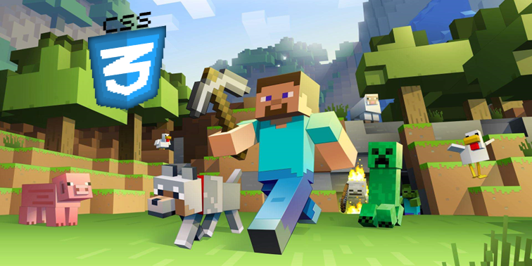

# Projeto Podcast - Santander 2024 [Fundamentos de IA para Devs]📖

Este repositório tem o intuito de disponibilizar aos usuários interessados o Podcast com o tema "Block by Block CSS: Construa seu conhecimento de CSS bloco a bloco".

Espero que gostem! Aproveitem!😄💕

# ARQUIVO DISPONIBILIZADO => Podcast.rar (Devido a tamanho não suportado pelo Github, acima de 25mb, disponibilizei o arquivo de maneira comprimida para que possa ser ouvido, grato pela compreensão). 

# Capa

# Ferramentas Utilizadas🛠
📑Roteiro - [ChatGPT](https://chatgpt.com/)  
🔊Áudio - [ElevenLabs](https://elevenlabs.io/)  
🖼Imagem - (Devido ao Midjourney não fornecer mais amostras) [Eu](https://www.linkedin.com/in/guilherme-mancusi-sim%C3%B5es-882873215/)

# Prompts Utilizados💻 
|    Ações      |      Prompt's |
| :-----------: | :-----------: |
| Título      | Forneça 3 opções de nomes criativos para um podcast com tema frontend, focado na principal linguagen CSS, voltado para o público de programadores gamers. |
| Roteiro    | Você é o roteirista de um podcast e precisamso criar um roteiro de um podcast sobre front end, relacionado a CSS principalmente com o nome "Block by Block CSS: Construa seu conhecimento de CSS bloco a bloco" com o público gamer como alvo. |
| Formato | FORMATO: [INTRODUÇÃO] [CURIOSIDADE 1] [CURIOSIDADE 2] [CURIOSIDADE 3] [CONCLUSÃO] |
| Regras |{REGRAS} >Foque em utilizar um vocabulário relacionado a jogos principalmente no estilo sandbox como terraria e minecraft. >Na [INTRODUÇÃO] introduza de uma maneira descontraída sem termos técnicos. >Na [CURIOSIDADE 1] começe falando sobre front end no geral engatando para o foco principal CSS. >Na [CURIOSIDADE 2] fale mais sobre CSS e utilizações gerais >Na [CURIOSIDADE 3] conte sobre quais ferramentas podem ser utilizadas para ajudar na hora de codificar. >Na [CONCLUSÃO] faça uma despedida calorosa e amigável com uma pequena retrospectiva dos fatos. >O podcast será apresentado por apenas uma pessoa. >Deve ter uma duração máxima de 7 minutos. |

# Sobre👨‍💻

Projeto e Repositório desenvolvidos por,  
Guilherme Mancusi Simões  
👨‍💻 [Linkedin](https://www.linkedin.com/in/guilherme-mancusi-sim%C3%B5es-882873215/)  
😸 [Github](https://github.com/GuiCrownguard)

